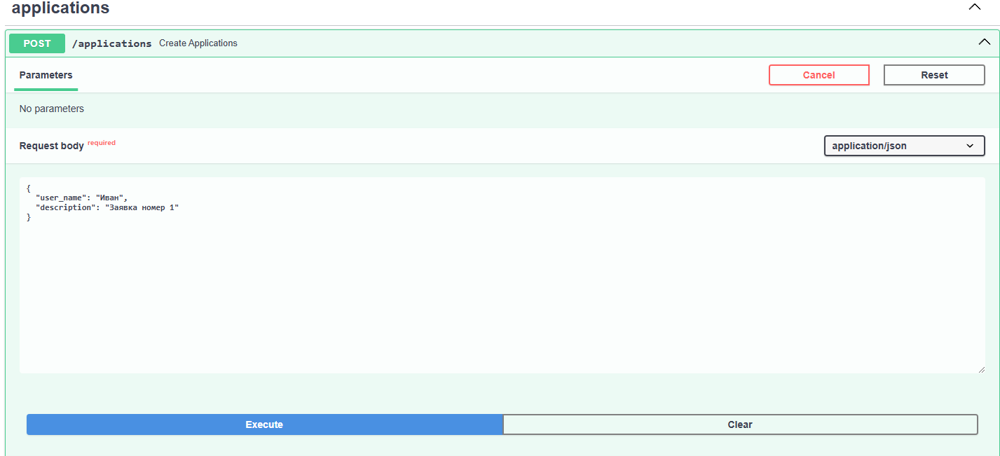

# python-kafka-test

## Описание

`python-kafka-test` — это приложение, которое позволяет создавать и получать заявки с помощью API, а также отправлять созданные заявки в topic Kafka.

## Функционал

1. **Создание заявок**
2. **Получение заявок**
3. **Отправка заявок с помощью Kafka**

## Установка

### Шаг 1: Клонирование репозитория 

Сначала клонируйте репозиторий на ваш локальный компьютер:
```bash
git clone https://github.com/hatai19/python-kafka-test.git
cd python-kafka-test
```

### Шаг 2: Запуск контейнеров
```bash
Запустите Docker-контейнеры с помощью Docker Compose:

docker-compose up -d --build
```

### Шаг 3: Выполнение миграций
Когда контейнеры будут запущены, выполните следующие команды для выполнения миграций. Для этого войдите в контейнер с проектом:


```bash
docker exec -it project /bin/bash
```
Затем выполните команды для миграции базы данных:

```bash
alembic revision --autogenerate -m 'initial'
alembic upgrade head
```
Примечания
Убедитесь, что у вас установлены Docker и Docker Compose на вашем локальном компьютере.

Теперь ваше приложение готово к использованию!

### Шаг 4: Примеры ответов и запросов:

Пример создания заявки:



Пример ответа:


Сообщения в Kafka(используем специальный UI,развернутый в docker-compose)


Пример ответа по запросу получения заявок с филтрацией и пагинацией:

